# Live Sales Copilot: End-to-End Pipeline Walkthrough

This document traces the complete chronological journey of a conversation frame from the physical sound capture in the user's browser, through low-latency local filters and cognitive classification layers, and down to the cascading visual stack on the agent's screen.

---

## 1. End-to-End Pipeline Flowchart

The following flowchart outlines the chronological path of audio capture, transcription, local gatekeeper checks, cognitive intent classification, context consolidation, search retrieval, suggestion generation, and visual card rendering.

```mermaid
flowchart TD
    %% Browser Capture
    subgraph Browser: Audio Capture & Mixing
        A1[Rep Microphone Stream] -->|Channel 0 - Left| A3[AudioContext Channel Merger]
        A2[Tab/Display Loopback Audio] -->|Channel 1 - Right| A3
        A3 -->|Interleave Float32 samples| A4[Convert to Int16 PCM]
        A4 -->|Send binary packet via WebSocket| B[stt-proxy Server]
    end

    %% STT Proxy Receive
    subgraph Server: STT Proxy & Transcription
        B -->|Accumulate PCM floats| B_Buf[repAudioSamples / customerAudioSamples]
        B -->|Forward raw PCM bytes| C[Deepgram Live Streaming SDK]
        C -->|Live Transcript Chunks JSON| B
        B -->|Process Chunk| D[TranscriptAggregator]
    end

    %% Transcript Aggregation
    subgraph Transcript Aggregation & SER
        D -->|Diarize via Channel Index| D1{Punctuation or VAD?}
        D1 -->|Yes| D2[Finalize Utterance Event]
        D2 -->|Extract wav2vec2 audio slice| SER[Speech Emotion Recognition]
        SER -->|Add Emotion & emotionScore| E[Unified Utterance Event]
    end

    %% Low-Latency Funnel
    subgraph Event Detector: Local Gatekeeper Funnel
        E -->|Scan playbooks & overrides| K_Scan{Any Keyword matched?}
        
        K_Scan -->|Yes| SetBypass[Flag NLI Zero-Shot Bypass & Collect Keyword Guidelines]
        SetBypass --> LLM1[Groq Llama 3.1 8B Classifier - LLM 1]
        
        K_Scan -->|No| H{Is Filler Utterance?}
        H -->|Yes| H_QA{isRespondingToQuestion?}
        H_QA -->|No| ExitGate[Gatekeeper Exit - Keep Screen Cards]
        H_QA -->|Yes| LLM1
        
        H -->|No| I{Is Simple Greeting?}
        I -->|Yes| ExitGate
        I -->|No| ZeroShot[Run Local Zero-Shot NLI DeBERTa]
        
        ZeroShot -->|"Score >= 80% Small Talk"| ExitZero[Exit - Keep Screen Cards]
        ZeroShot -->|"Score < 80% Small Talk"| LLM1
    end

    %% Cognitive Processing
    subgraph Server: Intent Routing & Safety Gate
        LLM1 -->|Classify intents & query| L3{Intents Empty / NONE?}
        L3 -->|Yes| ExitNone[Exit - Discard Guidelines & Clear/Keep-Going UI]
        L3 -->|No| M1[Gather Category & Keyword Guidelines]
    end

    %% Search & Prompt Build
    subgraph Server: Context Consolidation & LLM 2
        M1 --> QueryRAG[Query Vector RAG & Tavily Search]
        QueryRAG --> AssemblePrompt[Assemble Prompt Context]
        AssemblePrompt --> N1[Groq Llama 3.1 8B Suggestion Generator - LLM 2]
        N1 -->|Push suggest list via WS| UI[React HUD]
    end

    %% React UI Cascades
    subgraph Browser: UI Rendering & Cascading HUD
        UI --> UI_Jaccard{Jaccard Deduplication}
        UI_Jaccard -->|Overlap > 55%| UI_Discard[Discard Card]
        UI_Jaccard -->|Unique| UI_Slice[Render slice -3 in Stack]
        
        UI_Slice --> Slot1[Slot 1: Current Card - Glowing alert pulse, 100% opacity]
        UI_Slice --> Slot2[Slot 2: Previous Card - scale 0.95, 40% opacity, blurred]
        UI_Slice --> ExitCard[Exit Card: Triggers slideOutDown exit keyframe]
        
        Slot1 --> Q1[Transformers.js embedding on Rep spoken words]
        Q1 --> Q2{Cosine Similarity > 0.65?}
        Q2 -->|Yes| Q3[Mark Card Completed, flash green, shift focus down]
    end
```

---

## 2. Chronological Segment Breakdown

### Segment 1: Stereo Audio Capture & Mixer (Browser)
*   **Why it is there:** Capturing call audio with perfect client/agent separation. Standard browser diarization is slow and inaccurate. By forcing the Sales Rep's microphone into the Left channel and the customer's tab audio into the Right channel, we get a clean stereo stream with zero bleed or channel mixing.
*   **How it works:** Creates an `AudioContext` at 16kHz. Merges the microphone stream (`micSource`) and the screen/tab capture audio stream (`displaySource`) into a stereo `ChannelMergerNode`. A `ScriptProcessorNode` processes the interleaved stereo floats, scales them, converts them to 16-bit Int16 PCM, and streams the binary payload over a WebSocket.
*   **Code Mappings:**
    *   *Microphone access:* [`App.jsx: L305-L316`](file:///Users/arkapravorajkonwar/Documents/bruh/arkham/packages/ui/src/App.jsx#L305-L316)
    *   *Tab audio loopback capture:* [`App.jsx: L318-L340`](file:///Users/arkapravorajkonwar/Documents/bruh/arkham/packages/ui/src/App.jsx#L318-L340)
    *   *Stereo channel merger:* [`App.jsx: L342-L356`](file:///Users/arkapravorajkonwar/Documents/bruh/arkham/packages/ui/src/App.jsx#L342-L356)
    *   *Float32 to Int16 PCM conversion & sending:* [`App.jsx: L364-L387`](file:///Users/arkapravorajkonwar/Documents/bruh/arkham/packages/ui/src/App.jsx#L364-L387)

---

### Segment 2: Audio Accumulation & Deepgram Forwarding (STT Proxy)
*   **Why it is there:** Manages the active WebSocket connection with the client, unpacks PCM audio bytes, buffers waveforms for downstream analysis, and handles the low-latency streaming connection to the Deepgram Speech-to-Text API.
*   **How it works:** Listens for binary WebSocket messages from the browser. For every packet, it reads the interleaved Left/Right Int16 values, normalizes them back to float values, and pushes them into respective buffers (`repAudioSamples` / `customerAudioSamples`). Simultaneously, it forwards the raw PCM audio bytes to the Deepgram Live Transcription SDK using `multichannel: true`.
*   **Code Mappings:**
    *   *PCM unpacker & Float32 wave accumulator:* [`server.js: L580-L588`](file:///Users/arkapravorajkonwar/Documents/bruh/arkham/services/stt-proxy/server.js#L580-L588)
    *   *Deepgram listen options (multichannel, linear16, 16kHz):* [`server.js: L520-L529`](file:///Users/arkapravorajkonwar/Documents/bruh/arkham/services/stt-proxy/server.js#L520-L529)
    *   *Raw audio byte forwarding:* [`server.js: L593-L599`](file:///Users/arkapravorajkonwar/Documents/bruh/arkham/services/stt-proxy/server.js#L593-L599)

---

### Segment 3: Low-Latency Speech Emotion Recognition (SER)
*   **Why it is there:** Evaluates the vocal tone of both speaker channels in real-time, helping agents identify customer irritation, defensiveness, or positivity.
*   **How it works:** When a sentence is finalized, the proxy extracts the exact start and end timestamps from the transcription payload. It slices the corresponding segment out of the raw Float32 audio buffers, selects the correct channel buffer, and runs it through a local ONNX-quantized `wav2vec2-emotional-classification` model, appending the emotion label (e.g. `Agitated`) and confidence score.
*   **Code Mappings:**
    *   *Audio classification & mapping loop:* [`server.js: L220-L231`](file:///Users/arkapravorajkonwar/Documents/bruh/arkham/services/stt-proxy/server.js#L220-L231)

---

### Segment 4: Diarization-Free Transcript Aggregation
*   **Why it is there:** Converts raw, fragmented text chunks from Deepgram into coherent, complete sentences. By leveraging our hardware stereo channels, we perform instant speaker diarization without relying on slow cloud diarization models.
*   **How it works:** Checks the chunk's `channel_index` to route the transcript to the correct speaker buffer (0 = Rep, 1 = Customer).
    *   *Rule 1 (Punctuation):* Finalizes immediately if the word contains ending punctuation (`.`, `!`, `?`). This prevents latency for fast talkers.
    *   *Rule 2 (VAD Speech Final):* Finalizes if Deepgram's VAD flag `speech_final` is true, marking a natural pause.
    *   *Rule 3 (Watchdog Timer):* Runs a 3-second timeout that flushes the utterance if no finalization occurred, preventing stuck text.
*   **Code Mappings:**
    *   *Aggregator class definition:* [`Aggregator.js: L4-L10`](file:///Users/arkapravorajkonwar/Documents/bruh/arkham/services/transcript-aggregator/Aggregator.js#L4-L10)
    *   *processChunk channel mapping & punctuation check:* [`Aggregator.js: L13-L66`](file:///Users/arkapravorajkonwar/Documents/bruh/arkham/services/transcript-aggregator/Aggregator.js#L13-L66)
    *   *VAD Speech Final check:* [`Aggregator.js: L68-L74`](file:///Users/arkapravorajkonwar/Documents/bruh/arkham/services/transcript-aggregator/Aggregator.js#L68-L74)
    *   *finalizeUtterance event emitter:* [`Aggregator.js: L76-L99`](file:///Users/arkapravorajkonwar/Documents/bruh/arkham/services/transcript-aggregator/Aggregator.js#L76-L99)

---

### Segment 5: Unified Keyword Scanner & NLI Bypass
*   **Why it is there:** Pre-scans the text in under 1ms to check for known business keywords. If a keyword is matched, we flag a zero-shot NLI bypass, ensuring critical business topics bypass local small-talk filters and route directly to the cloud classifier.
*   **How it works:** Scans the utterance case-insensitively against playbook-specific custom guidelines inside `keyword_bypasses.json` and a protected list of universal sales keywords (`CORE_SALES_KEYWORDS`). Custom keyword guidelines are dynamically gathered, and matching core keywords are excluded if they conflict with overridden bypass rules.
*   **Code Mappings:**
    *   *Bypass scanning & matched keyword guideline collection:* [`server.js: L258-L275`](file:///Users/arkapravorajkonwar/Documents/bruh/arkham/services/stt-proxy/server.js#L258-L275)
    *   *Core sales keywords safeguards filtering:* [`server.js: L277-L280`](file:///Users/arkapravorajkonwar/Documents/bruh/arkham/services/stt-proxy/server.js#L277-L280)
    *   *Detector safeguard scan integration:* [`detector.js: L67-L98`](file:///Users/arkapravorajkonwar/Documents/bruh/arkham/services/event-detector/detector.js#L67-L98)

---

### Segment 6: Symmetric Gatekeeper Funnel
*   **Why it is there:** Safeguards the pipeline from wasting cloud API cost and latency on filler words ("yes", "okay", "yo") and casual greetings.
*   **How it works:**
    *   *Filler check:* Checks if the text consists entirely of filler words. If yes, it exits early (0ms).
    *   *QA Context Bypass:* If the other speaker just asked a question, it overrides the filler gatekeeper, passing short replies (e.g. replying "No" to "Do you use Salesforce?") through to LLM 1.
    *   *Greeting check:* Checks for basic greetings. If yes, exits early.
    *   *Local Zero-Shot check:* If no sales keywords matched in Segment 5, runs the text through `Xenova/nli-deberta-v3-small`. If small talk score is `>= 80%`, it exits early. Otherwise, it proceeds to LLM 1.
*   **Code Mappings:**
    *   *isFillerUtterance:* [`detector.js: L123-L133`](file:///Users/arkapravorajkonwar/Documents/bruh/arkham/services/event-detector/detector.js#L123-L133)
    *   *isSimpleGreeting:* [`detector.js: L135-L140`](file:///Users/arkapravorajkonwar/Documents/bruh/arkham/services/event-detector/detector.js#L135-L140)
    *   *QA Context check:* [`detector.js: L213-L228`](file:///Users/arkapravorajkonwar/Documents/bruh/arkham/services/event-detector/detector.js#L213-L228)
    *   *isZeroShotSmallTalk (DeBERTa v3 check):* [`detector.js: L100-L120`](file:///Users/arkapravorajkonwar/Documents/bruh/arkham/services/event-detector/detector.js#L100-L120)

---

### Segment 7: Intent Classification (LLM 1)
*   **Why it is there:** Identifies the precise sales categories present in the conversation (e.g. `FEES`, `COMPETITOR`) and generates a structured keyword search query to retrieve manual facts.
*   **How it works:** Packages the sliding conversation window and system instructions, then queries `llama-3.1-8b-instant` via HTTP POST. It requests a strictly formatted JSON response containing the matching categories, confidence scores, entities, and search query.
*   **Code Mappings:**
    *   *System prompt builder:* [`detector.js: L147-L181`](file:///Users/arkapravorajkonwar/Documents/bruh/arkham/services/event-detector/detector.js#L147-L181)
    *   *queryGroq API call:* [`detector.js: L298-L332`](file:///Users/arkapravorajkonwar/Documents/bruh/arkham/services/event-detector/detector.js#L298-L332)

---

### Segment 8: NONE Intent Check Early Exit
*   **Why it is there:** Acts as a safety gate. If LLM 1 classifies the utterance as `NONE` (no valid sales topic found), we discard all matched keyword guidelines and terminate the pipeline, preventing false suggestion triggers.
*   **How it works:** Evaluates the classified intents array. If empty, it exits. If it was a customer speaking, it transmits a clean keep-going signal ("Great job, keep going!") to the UI.
*   **Code Mappings:**
    *   *NONE intents array filter:* [`detector.js: L143-L145`](file:///Users/arkapravorajkonwar/Documents/bruh/arkham/services/event-detector/detector.js#L143-L145)
    *   *Early exit check:* [`server.js: L299-L321`](file:///Users/arkapravorajkonwar/Documents/bruh/arkham/services/stt-proxy/server.js#L299-L321)

---

### Segment 9: Dynamic Guidelines Consolidation & Context Assembly
*   **Why it is there:** Gathers all playbooks and guidelines relevant to the matched categories and keywords in the sentence, putting them in one place to feed LLM 2.
*   **How it works:** Gathers the playbook rules mapped under `categories.json` for active intents, filters those set to `"behavior": "guideline"`, extracts their `guidelineText`, and merges them with the `matchedKeywordGuidelines` array gathered in Segment 5.
*   **Code Mappings:**
    *   *Guidelines gather & merge:* [`server.js: L337-L360`](file:///Users/arkapravorajkonwar/Documents/bruh/arkham/services/stt-proxy/server.js#L337-L360)

---

### Segment 10: Vector RAG & Tavily Search Retrieval
*   **Why it is there:** Enriches the prompt with factual manuals, and fallback real-time web data (like competitor pricing) if internal data is sparse.
*   **How it works:**
    *   *RAG search:* Computes MiniLM embedding of the search query and queries Qdrant (or local mock vector search) to fetch the top 3 matching manual segments.
    *   *Tavily Fallback:* If it is a public category (e.g. competitor) and RAG confidence is low (< 0.60), triggers a Tavily API web search. Fetches search results and applies a local MiniLM relevance similarity filter to discard unrelated web noise.
*   **Code Mappings:**
    *   *Vector RAG search execution:* [`server.js: L363-L370`](file:///Users/arkapravorajkonwar/Documents/bruh/arkham/services/stt-proxy/server.js#L363-L370)
    *   *Tavily web search & local relevance filtering:* [`server.js: L430-L482`](file:///Users/arkapravorajkonwar/Documents/bruh/arkham/services/stt-proxy/server.js#L430-L482)

---

### Segment 11: Grounded Suggestion Generation (LLM 2)
*   **Why it is there:** Generates 2-3 dynamic checklist bullet points for the agent, grounding advice strictly in playbooks, guidelines, and search data.
*   **How it works:** Assembles the full prompt incorporating conversation context, playbook guidelines, RAG facts, and web search results. Queries `llama-3.1-8b-instant`, formats output as bullet points containing a spoken suggestion in parentheses (e.g. `(Say: "...")`), and pushes the suggestions over the client WebSocket.
*   **Code Mappings:**
    *   *Suggestion prompt context & grounding instructions:* [`server.js: L483-L517`](file:///Users/arkapravorajkonwar/Documents/bruh/arkham/services/stt-proxy/server.js#L483-L517)

---

### Segment 12: HUD Stack Layout & Cascade Rendering (Browser UI)
*   **Why it is there:** Presents advice cues to the agent without causing visual overwhelm. Only the current active card and the immediate previous card are shown.
*   **How it works:**
    *   *Deduplication:* Compares incoming cards using a Jaccard word overlap filter. If similarity is > 55%, it discards the card to prevent duplicate suggestions.
    *   *Inverted Cascades:* The UI maps `focusQueue.slice(-3)` to display exactly 2 stacked cards. Slot 1 (Current Card) is highlighted with an alert border pulse. Slot 2 (Previous Card) is scaled down to 0.95 and set to 40% opacity. If a new card arrives, the old Slot 2 card transitions to the Exit Card position, triggering `@keyframes slideOutDown` to slide down out of the viewport.
*   **Code Mappings:**
    *   *Jaccard word overlap check:* [`App.jsx: L160-L190`](file:///Users/arkapravorajkonwar/Documents/bruh/arkham/packages/ui/src/App.jsx#L160-L190)
    *   *3-Card Array rendering map:* [`App.jsx: L1117-L1155`](file:///Users/arkapravorajkonwar/Documents/bruh/arkham/packages/ui/src/App.jsx#L1117-L1155)
    *   *CSS transition properties, alert pulse, and exit keyframes:* [`App.css: L1388-L1442`](file:///Users/arkapravorajkonwar/Documents/bruh/arkham/packages/ui/src/App.css#L1388-L1442)

---

### Segment 13: Local Semantic Completion Loop
*   **Why it is there:** Closes the loop. Automatically completes suggestions as the agent speaks, removing cues from the screen without requiring mouse clicks.
*   **How it works:** Runs a local INT8 quantized `all-MiniLM-L6-v2` embedding model inside the agent's browser. When the agent speaks, it embeds their sentence and computes the cosine similarity against the `singlePhrase` target cue. If similarity is > 0.65, the card is marked as completed, turning emerald green before sliding off-screen.
*   **Code Mappings:**
    *   *Local MiniLM initialization:* [`App.jsx: L107-L124`](file:///Users/arkapravorajkonwar/Documents/bruh/arkham/packages/ui/src/App.jsx#L107-L124)
    *   *Cosine similarity check & card completion loop:* [`App.jsx: L199-L266`](file:///Users/arkapravorajkonwar/Documents/bruh/arkham/packages/ui/src/App.jsx#L199-L266)
