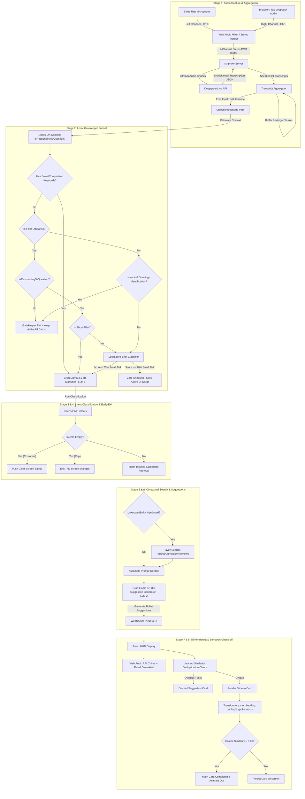

# The Live Conversation Analytics & Event Detection Pipeline

This document provides a comprehensive, end-to-end technical breakdown of the Sales Copilot system. It traces the lifecycle of a spoken phrase from physical sound capture to real-time AI assistance, and finally to semantic check-off on the representative's screen, highlighting the exact lines in the codebase where each logic resides.

---

## 1. End-to-End Pipeline Architecture

The system utilizes a dual-path pipeline: a low-latency local gatekeeper path running on the Node.js server and client browser (~0ms–20ms), and a cognitive cloud path utilizing Groq's Llama 3.1 8B API and Tavily search (~100ms–250ms).

---

## 2. Step-by-Step Processing Deep Dive

### Stage 1: Hardware Audio Capture & Multi-Channel Separation

1. **Physical Sound Input**:
   - The React UI client captures the Sales Rep's local voice via the browser's microphone input.
     * *Code Location*: [App.jsx: L287-298](file:///Users/arkapravorajkonwar/Documents/arkham/packages/ui/src/App.jsx#L287-L298) inside the `startRecordingSession()` routine.
   - Simultaneously, the client captures the incoming customer audio via tab or window audio loopback.
     * *Code Location*: [App.jsx: L303-325](file:///Users/arkapravorajkonwar/Documents/arkham/packages/ui/src/App.jsx#L303-L325) using `navigator.mediaDevices.getDisplayMedia`.
2. **Channel Separation Mixer**:
   - The React app instantiates a Web Audio API `AudioContext` and a `ChannelMergerNode` with `numberOfInputs = 2`.
     * *Code Location*: [App.jsx: L327-359](file:///Users/arkapravorajkonwar/Documents/arkham/packages/ui/src/App.jsx#L327-L359).
   - The microphone stream is connected to input 0 (Left channel), and the browser/speaker loopback stream is connected to input 1 (Right channel).
   - This ensures **hardware-level stereo mapping**:
     - **Channel 0** is mathematically locked to the **Sales Rep** (`speaker: 0`).
     - **Channel 1** is mathematically locked to the **Customer** (`speaker: 1`).
3. **Deepgram Transcription Ingestion**:
   - The mixed stereo audio stream is sliced into 250ms buffers and sent as binary blobs over a WebSocket connection to the `stt-proxy` server.
     * *Code Ingestion Location*: [App.jsx: L637-665](file:///Users/arkapravorajkonwar/Documents/arkham/packages/ui/src/App.jsx#L637-L665) inside `startAudioCapture()`.
   - The proxy establishes a connection to the Deepgram Live Streaming API with the following parameters:
     - `diarize: false`: AI clustering speaker diarization is disabled. Standard AI diarization clusters speakers dynamically, meaning that whoever speaks first is assigned ID 0. Enforcing channel-locked speaker separation resolves this 100% reliably.
     - `multichannel: true`: Enforces independent transcription of each stereo channel.
     - `channels: 2`: Notifies the engine of two distinct channels.
     - `endpointing: 500`: Enables Voice Activity Detection (VAD) on Deepgram's side with a 500ms silence threshold.
     - `smart_format: true`, `interim_results: true`.
     * *Code Location*: [server.js: L436-458](file:///Users/arkapravorajkonwar/Documents/arkham/services/stt-proxy/server.js#L436-L458) inside the connection setup.
4. **Proxy Separation**:
   - Deepgram streams back JSON payloads containing the transcribed text and the `channel_index` field (0 or 1).
   - The proxy maps `channel_index: 0` to `speaker: 0` (Rep) and `channel_index: 1` to `speaker: 1` (Customer).
     * *Code Location*: [server.js: L468-478](file:///Users/arkapravorajkonwar/Documents/arkham/services/stt-proxy/server.js#L468-L478).

---

### Stage 2: Low-Latency Utterance Aggregation

Before sending transcripts to the NLP classifiers, raw, noisy text fragments must be reconstructed into cohesive sentences.

1. **Speaker Buffers**:
   - The `TranscriptAggregator` maintains an active Map of buffers keyed by speaker ID.
     * *Code Location*: [Aggregator.js: L8-L10](file:///Users/arkapravorajkonwar/Documents/arkham/services/transcript-aggregator/Aggregator.js#L8-L10) (`this.activeUtterances`).
2. **Utterance Finalization Rules**:
   An utterance buffer for a given speaker is finalized and flushed to the NLP pipeline when any of the following rules are met:
   - **Rule 1: Punctuation Ending**: The incoming word chunk ends with a sentence terminator (`.`, `!`, `?`). This handles fast talkers who speak multiple sentences in a single stretch.
     * *Code Location*: [Aggregator.js: L25-L60](file:///Users/arkapravorajkonwar/Documents/arkham/services/transcript-aggregator/Aggregator.js#L25-L60) inside `processChunk()`.
   - **Rule 2: VAD / Speech Final**: Deepgram triggers `speech_final: true` (which fires after 500ms of silence on the channel). This handles natural pauses.
     * *Code Location*: [Aggregator.js: L68-L73](file:///Users/arkapravorajkonwar/Documents/arkham/services/transcript-aggregator/Aggregator.js#L68-L73).
   - **Rule 3: Watchdog Timeout**: A fallback timer of 3000ms triggers if no punctuation is found and VAD fails to trigger. This prevents text from getting stuck in memory buffers indefinitely.
     * *Code Location*: [Aggregator.js: L61-L65](file:///Users/arkapravorajkonwar/Documents/arkham/services/transcript-aggregator/Aggregator.js#L61-L65) and [Aggregator.js: L80-L84](file:///Users/arkapravorajkonwar/Documents/arkham/services/transcript-aggregator/Aggregator.js#L80-L84).
   - **Finalization & Emission**: The finalized event is structured and emitted.
     * *Code Location*: [Aggregator.js: L76-L100](file:///Users/arkapravorajkonwar/Documents/arkham/services/transcript-aggregator/Aggregator.js#L76-L100).
3. **History Cache**:
   - Once finalized, the utterance is appended to the session's sliding `conversationHistory` cache (limited to the last 10 turns to avoid context bloat).
     * *Code Location*: [server.js: L266-274](file:///Users/arkapravorajkonwar/Documents/arkham/services/stt-proxy/server.js#L266-L274).

---

### Stage 3: Symmetric Gatekeeper Funnel & Question-Answering Routing (~0ms–20ms)

To minimize Groq cloud API costs and reduce response latency, the system routes the finalized text through a local gatekeeper funnel. Rep and Customer utterances are treated through the exact same processing pipeline.

The pipeline executes the gatekeeper checks in the logical execution order matching the codebase:

1. **Step A: Question-Answering Context Resolution**:
   - The context resolver traverses history to check if the current speaker is responding to a question from the *other* speaker.
   - For example, if the current speaker is Customer, it checks if the Rep's last utterance ended with a `?` or a question-asking grammatical pattern.
   - If a question is found, `isRespondingToQuestion` is set to `true`.
     * *Code Location*: [detector.js: L246-L260](file:///Users/arkapravorajkonwar/Documents/arkham/services/event-detector/detector.js#L246-L260).
2. **Step B: Filler Check (0ms)**:
   - Filters out short, low-content filler words (e.g. *yeah, ok, mhm, no*) under 4 words.
   - **Bypass**: If `isRespondingToQuestion` is `true`, these filler words represent crucial decisions (agreement/disagreement) and bypass this early exit check. If `isRespondingToQuestion` is `false`, they are classified as empty chatter and exit immediately.
     * *Code Location*: `isFillerUtterance` helper is at [detector.js: L131-L141](file:///Users/arkapravorajkonwar/Documents/arkham/services/event-detector/detector.js#L131-L141); checked at [detector.js: L262-L268](file:///Users/arkapravorajkonwar/Documents/arkham/services/event-detector/detector.js#L262-L268).
3. **Step C: Neutral / Greeting Check (0ms)**:
   - Filters out greetings (*"hello, good morning"*) and neutral identity confirmations (*"is this Newton School?"*) that are complete sentences but contain no sales or objection topics.
   - **Note on Difference with Step B**: Step B filters short, non-sentence filler words (which can bypass via QA context). Step C filters complete sentence greetings and administrative identity confirmations (which do NOT bypass via QA context, because greetings do not represent decision-making inputs).
     * *Code Location*: `isNeutralOrGreeting` helper is at [detector.js: L143-L172](file:///Users/arkapravorajkonwar/Documents/arkham/services/event-detector/detector.js#L143-L172); checked at [detector.js: L270-L276](file:///Users/arkapravorajkonwar/Documents/arkham/services/event-detector/detector.js#L270-L276).
4. **Step D: Sales/Comparison Keyword Bypass**:
   - The text is matched against `SALES_KEYWORDS`. If any keyword matches (e.g. *fees*, *placement*, *vs*, *scaler*, *masai*), it **immediately bypasses all subsequent checks** (including zero-shot) and routes directly to Groq LLM 1.
     * *Code Location*: Keyword list is at [detector.js: L47-L65](file:///Users/arkapravorajkonwar/Documents/arkham/services/event-detector/detector.js#L47-L65); checked at [detector.js: L278-L300](file:///Users/arkapravorajkonwar/Documents/arkham/services/event-detector/detector.js#L278-L300).
5. **Step E: Local Zero-Shot Classifier (20ms)**:
   - If the text has no sales keywords, it runs a local NLI model inside the Node process (`Xenova/nli-deberta-v3-small`) to score it against small talk/pleasantries.
   - **Question Response Routing**: Answering a question does not directly bypass the zero-shot classifier. Instead:
     - If the response is a short filler word (like `"Yeah."`), it directly bypasses the zero-shot model because running NLI on single words in isolation is highly prone to misclassification.
     - If it is a longer sentence, it is routed to the zero-shot classifier. To prevent Deberta from misclassifying context-reliant responses (like *"No, we actually use that instead."*) as small talk in isolation, the resolver prepends the preceding question context (e.g. *"Do you guys currently use Salesforce for your sales reps? No, we actually use that instead."*).
   - If the small talk score is $\ge 70\%$, the pipeline exits early. Otherwise, it proceeds to LLM 1.
     * *Code Location*: Local model check is at [detector.js: L108-L128](file:///Users/arkapravorajkonwar/Documents/arkham/services/event-detector/detector.js#L108-L128) using model loaded in `initClassifier()`; checked at [detector.js: L283-L299](file:///Users/arkapravorajkonwar/Documents/arkham/services/event-detector/detector.js#L283-L299).

---

### Stage 4: Intent Classification Cognitive Router (LLM 1) (~120ms)

If the local gatekeeper funnel is bypassed, the proxy server sends the conversation history to the Groq Llama 3.1 8B Classifier (`llama-3.1-8b-instant`):

1. **Input Context**: Formatted conversation history sliding window:
   - Formatted using the `formatContext()` helper at [detector.js: L216-L229](file:///Users/arkapravorajkonwar/Documents/arkham/services/event-detector/detector.js#L216-L229).
2. **System Prompt Category Schema**: The classifier categorizes the utterance using shortened, topic-focused keys defined in the prompt:
   - `FEES`, `PLACEMENT`, `DEGREE`, `BUDGET`, `TIMELINE`, `SWITCHING`, `COMPETITOR`, `BUY_SIGNAL`, `INQUIRY`, `NONE`.
   - *Code Location*: System prompt definition is at [detector.js: L179-L214](file:///Users/arkapravorajkonwar/Documents/arkham/services/event-detector/detector.js#L179-L214).
3. **Structured Output & Groq Call**:
   - The classifier is constrained using JSON Mode to output parsed intents.
   - *Code Location*: The Groq call and JSON parsing logic resides in `queryGroq()` at [detector.js: L314-L348](file:///Users/arkapravorajkonwar/Documents/arkham/services/event-detector/detector.js#L314-L348).
4. **Early Exit Validation**:
   - `NONE` categories are removed via `mergeIntents()` at [detector.js: L174-L177](file:///Users/arkapravorajkonwar/Documents/arkham/services/event-detector/detector.js#L174-L177).
   - If `detectResult.intents.length === 0`:
     - If the Rep spoke, the pipeline exits (no screen changes).
     - If the Customer spoke a full neutral statement, the server pushes a clear screen signal (`"Great job, keep going!"`) to clear stale cards. Downstream LLM 2 is skipped.
     - *Code Location*: Exits handled in [server.js: L307-L330](file:///Users/arkapravorajkonwar/Documents/arkham/services/stt-proxy/server.js#L307-L330).

---

### Stage 5: Context Retrieval & Real-Time Competitor Web Search (~150ms)

If active intents are identified, the proxy server retrieves supporting context:

1. **Handbook Playbook Facts**:
   - Looks up `PLAYBOOK_FACTS` for the active playbook matching the detected intent.
     * *Code Location*: facts database is at [server.js: L75-L120](file:///Users/arkapravorajkonwar/Documents/arkham/services/stt-proxy/server.js#L75-L120) and fact retrieval is at [server.js: L122-L139](file:///Users/arkapravorajkonwar/Documents/arkham/services/stt-proxy/server.js#L122-L139).
2. **Real-Time Tavily Search (Dual-Lane Hybrid Logic)**:
   - If an entity is extracted by LLM 1 but is not in our local static competitor/playbook database (e.g. *"Coding Ninjas"*, *"AlmaBetter"*), the server queries the **Tavily Search API**. This captures all **unknown entities** dynamically (not just competitors).
     * *Code Location*: Tavily API search wrapper is at [server.js: L141-L178](file:///Users/arkapravorajkonwar/Documents/arkham/services/stt-proxy/server.js#L141-L178); triggered at [server.js: L348-L362](file:///Users/arkapravorajkonwar/Documents/arkham/services/stt-proxy/server.js#L348-L362).

---

### Stage 6: Suggestion Generation (LLM 2) (~150ms)

The aggregated guidelines, Tavily search snippets, and conversation logs are sent to the Groq Llama 3.1 8B Suggestion Generator (`llama-3.1-8b-instant`):

1. **System Prompt & Constraints**:
   - Constraints: Outputs a maximum of 2 to 3 bullet points, formatted strictly as direction cues with a single suggested respond phrase in parentheses: `(Say: "...")`. Instructs the model to dynamically weave search findings into comparison phrasing.
     * *Code Location*: System prompt construction is at [server.js: L370-L389](file:///Users/arkapravorajkonwar/Documents/arkham/services/stt-proxy/server.js#L370-L389).
2. **Groq Execution**:
   - Sends prompt context to Groq and posts suggestions to the client browser.
     * *Code Location*: Resides in [server.js: L391-L421](file:///Users/arkapravorajkonwar/Documents/arkham/services/stt-proxy/server.js#L391-L421).

---

### Stage 7: WebSocket Push, UI Rendering & Chime Alerts

1. **UI Parsing & Small Talk Filtration**:
   - The React app parses the incoming suggestions, stripping out bullets and isolating the `(Say: "...")` phrase.
     * *Code Location*: Suggestion text line parsing logic is at [App.jsx: L538-L596](file:///Users/arkapravorajkonwar/Documents/arkham/packages/ui/src/App.jsx#L538-L596).
2. **Web Audio Chime & Visual Flash**:
   - For new unique suggestions, the app synthesizes a clean **880Hz electronic chime** using the browser's Web Audio API and triggers a glowing CSS alert.
     * *Code Location*: Oscillator sound chime synthesizer logic is at [App.jsx: L456-L479](file:///Users/arkapravorajkonwar/Documents/arkham/packages/ui/src/App.jsx#L456-L479).
3. **Jaccard Similarity Deduplication**:
   - Compares incoming cards against active cards using a Jaccard Word-Similarity index to filter duplicates.
     * *Code Location*: Jaccard overlap helper is at [App.jsx: L157-L187](file:///Users/arkapravorajkonwar/Documents/arkham/packages/ui/src/App.jsx#L157-L187); checked inside the queue updater at [App.jsx: L598-L617](file:///Users/arkapravorajkonwar/Documents/arkham/packages/ui/src/App.jsx#L598-L617).

---

### Stage 8: Closing the Loop: Semantic Check-off via Browser Embeddings

As the Sales Rep speaks, the system automatically checks off items as they say them:

1. **Local Browser Embedder**:
   - Loads a quantized, INT8 version of the **`all-MiniLM-L6-v2`** model on mount.
     * *Code Location*: [App.jsx: L107-L124](file:///Users/arkapravorajkonwar/Documents/arkham/packages/ui/src/App.jsx#L107-L124).
2. **Cosine Similarity Helper**:
   - Mathematical helper defining the cosine similarity computation between vector dimensions.
     * *Code Location*: [App.jsx: L141-L155](file:///Users/arkapravorajkonwar/Documents/arkham/packages/ui/src/App.jsx#L141-L155).
3. **Semantic Completion Engine Loop**:
   - Computes similarity between Rep's spoken vector and suggestion cards. If similarity > 0.65, marks cards completed.
     * *Code Location*: Embedding generation and check-off logic is at [App.jsx: L196-L263](file:///Users/arkapravorajkonwar/Documents/arkham/packages/ui/src/App.jsx#L196-L263).
     * *Rep role enforcement check*: Implemented at [App.jsx: L206-L209](file:///Users/arkapravorajkonwar/Documents/arkham/packages/ui/src/App.jsx#L206-L209).
