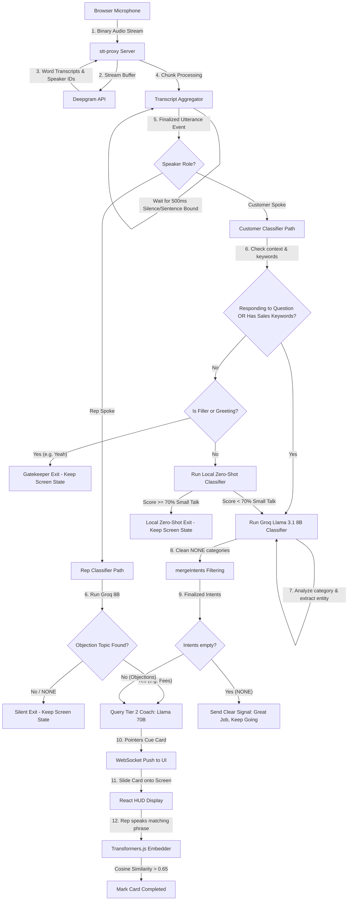

# The Live Conversation Analytics & Event Detection Pipeline

This document details the complete end-to-end architecture of the sales copilot, tracing how a spoken sentence flows from audio capture to live coaching cue cards on the representative's screen.

---

## 1. Pipeline Flow Architecture

---

## 2. Step-by-Step Processing Stages

### Stage 1: Audio Capture & Finalization
1. **Streaming**: The browser records speech and streams raw audio chunks to [server.js](file:///Users/arkapravorajkonwar/Documents/arkham/services/stt-proxy/server.js) over a WebSockets channel.
2. **Transcription & Diarization**: The server forwards the audio directly to the Deepgram Live API, which returns transcribing text chunks enriched with speaker channel IDs (`speaker: 0` for Rep, `speaker: 1` for Customer).
3. **Sentence Aggregation**: The [TranscriptAggregator](file:///Users/arkapravorajkonwar/Documents/arkham/services/transcript-aggregator/Aggregator.js) buffers the individual word chunks. It monitors for speech boundaries and triggers a finalized sentence event only when the speaker ceases talking for **500ms** (VAD threshold).

---

### Stage 2: Role Mapping & Local Gatekeepers (~0ms–30ms)
Once a sentence is finalized, it enters the multi-stage gatekeeper check inside [detector.js](file:///Users/arkapravorajkonwar/Documents/arkham/services/event-detector/detector.js):

1. **Short Filler Check (0ms)**: The text is checked using `isFillerUtterance()`. If the word length is under 4 words and matches common filler words (e.g. *"yeah"*, *"okay"*), it checks if the customer was answering a question (`isRespondingToQuestion`).
   * If not answering a question: exits in **0ms** with `source: 'gatekeeper'`. Screen state is persisted.
2. **Neutral/Greeting Check (0ms)**: The text is evaluated via `isNeutralOrGreeting()`. If it contains standard greetings (*"hello"*, *"good morning"*) or basic name checks (*"is this Newton School?"*) without sales terms:
   * Exits in **0ms** with `source: 'neutral_filter'`. Screen state is persisted.
3. **Sales Playbook Keyword Guard (0ms)**: We match words against a pre-compiled `SALES_KEYWORDS` set (containing words like *fees, placements, salary, syllabus, schedule, book, etc.*).
   * If the sentence contains a sales keyword, it **bypasses the zero-shot classifier** and goes straight to the Groq classifier for domain analysis.
4. **Local Zero-Shot Classifier (~20ms)**: If the sentence is longer, has no sales keywords, and isn't a direct answer to a question, it runs locally in Node.js using `@xenova/transformers` with `Xenova/nli-deberta-v3-small`.
   * It classifies the text against two candidate labels: `['small talk or pleasantry or greeting', 'sales course admission inquiry or objection']`.
   * If the small talk confidence is **$\ge 70\%$**, the system exits early with `source: 'local_zeroshot'`. The Groq API is bypassed, reducing cloud costs and latency to 0.

---

### Stage 3: Cognitive Classifier & Dynamic Entity Extraction
If the gatekeeper is bypassed, the utterance is sent to the **Groq Llama 3.1 8B classifier**:
1. **Inputs**: The model receives the full formatted history context and the system prompt instructions.
2. **Dynamic Entity Extraction**: The system prompt instructs Llama 3.1 8B to classify the category (e.g. `COMPETITOR`) and dynamically parse the text to extract the exact name of the entity (`"entity"` field), even if the competitor is new/unknown.
3. **Speed**: Groq's LPU hardware resolves this query in **~150ms** with a `temperature` of `0.0` for deterministic outputs.

---

### Stage 4: Classification Filtering (`mergeIntents`)
Once the LLM returns its classifications, [mergeIntents()](file:///Users/arkapravorajkonwar/Documents/arkham/services/event-detector/detector.js) filters out any neutral or empty outcomes (`cat: "NONE"`). By relying entirely on the LLM for classification and entity extraction, we avoid the complexity of merging conflicting Regex priority lists.

---

### Stage 5: Early Exit vs. Tier 2 Generation
Depending on the final filtered intents array, [server.js](file:///Users/arkapravorajkonwar/Documents/arkham/services/stt-proxy/server.js) routes the workflow:
* **Branch A: No Active Intents**:
  * If the Customer spoke a full neutral statement, the server pushes `"Great job, keep going!"` to clear active cards.
  * If the Customer spoke a simple filler word or if the Rep spoke general info, the server exits silently. **No further LLM calls are made.**
* **Branch B: Active Objection/Topic Found**:
  * The proxy server queries **Tier 2 (Groq Llama 3.3 70B)**.
  * The prompt combines the conversation history, the active sales playbook guidelines, and the specific verified intent (e.g. `COMPETITOR (Codecademy)`).
  * Llama 3.3 70B generates exactly 2 to 3 bullet points with a specific direction and phrasing cue.

---

### Stage 6: UI Render & Semantic Closing
1. **Socket Push**: The server pushes the generated coaching tips to the React UI WebSocket channel.
2. **HUD Render**: The React UI parses the tips and slides new interactive cue cards onto the copilot panel.
3. **Semantic Completion Check**: When the Rep speaks, the browser's local **Transformers.js embedder** calculates the vector similarity of the Rep's words against the suggested answer phrases on screen.
   * If Cosine Similarity exceeds **0.65**, the card is checkmarked and completed, closing the coaching loop.

---

## 3. Workflow Scenarios Walkthrough

| Speaker | Utterance | Preceding Rep Context | Cognitive Intent Output / Gatekeeper Source | Final Result |
| :--- | :--- | :--- | :--- | :--- |
| Customer | *"Yeah."* | *"Newton School has MNC hiring partners."* | Bypassed. Ignored by gatekeeper in 0ms (`gatekeeper`). | No API call. Cards persist. |
| Customer | *"Yeah."* | *"Would you like to take the scholarship test today?"* | Bypasses gatekeeper. Classified: `SIGNAL_BUY` (`cognitive`). | Passes to Llama 70B. Renders next-steps card. |
| Customer | *"I'm in Mumbai right now, it is super hot."* | *"We have standard curriculum tracks."* | Caught by Local Zero-Shot (86.8% score) in 33ms (`local_zeroshot`). | No API call. Cards persist. |
| Customer | *"Wait, we were actually looking at Codecademy."* | *"We have standard curriculum tracks."* | Bypasses gatekeeper. Classified: `COMPETITOR` (entity: `Codecademy`) (`cognitive`). | Passes to Llama 70B. Renders Codecademy battlecard. |
| Customer | *"Okay, that makes sense."* | N/A | Bypasses gatekeeper. Classified: `NONE` (`cognitive`). | Sends clear signal (Great Job, Keep Going). |
| Rep | *"Okay, let's talk about placements."* | N/A | Bypasses gatekeeper. Classified: `OBJ_PLACEMENT` (`cognitive`). | Passes to Llama 70B. Renders placement stats. |
