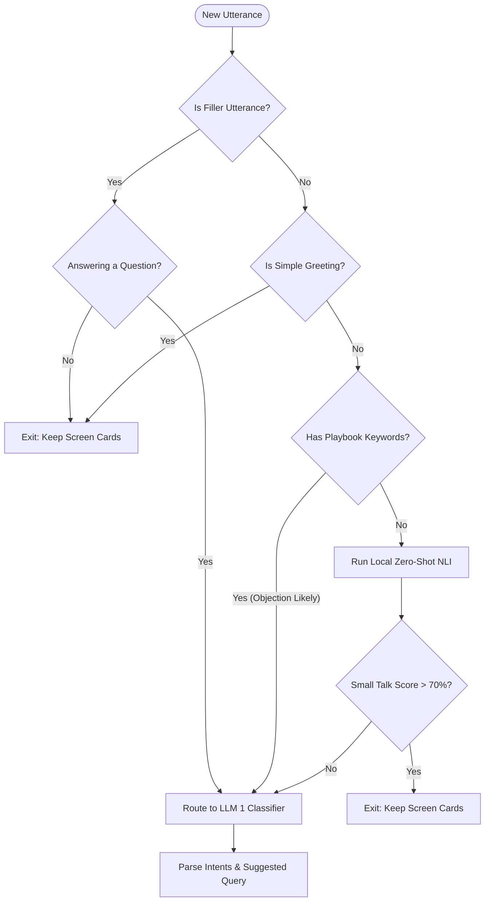

# Gatekeeper Merger Pipeline Specifications

This document outlines the proposed **Stage 3 & 4 Gatekeeper Merger** in the Event Detector pipeline. It shows how we verify utterances to filter out greetings, names checks, and connectivity checks.

---

## 1. Flowchart Diagram (Mermaid)

---

## 2. Detailed Execution Path Breakdown

Here is a step-by-step description of the flow, outlining how each check executes and why:

### **Stage 1: Filler Exit Check (0ms)**
*   **Method Called:** `isFillerUtterance(text)`
*   **What it does:** Checks if the sentence has less than 4 words and contains only filler words (`yeah`, `yes`, `ok`, `no`, `yup`, `sure`, etc.).
*   **Logic Branch:**
    *   If **Yes**, check if this is the Customer responding to a direct Rep question.
        *   If the Customer is *not* responding to a question (e.g. just saying "yeah" in the background) $\to$ **Exit Early** (keeps active cards).
        *   If the Customer *is* responding to a question (e.g. Rep asked "can we connect?" and Customer said "yes") $\to$ **Proceed to Stage 2**.
    *   If **No** (long or meaningful statement) $\to$ **Proceed to Stage 2**.

### **Stage 2: Simple Greeting Exit Check (0ms)**
*   **Method Called:** `isSimpleGreeting(text)`
*   **What it does:** Scans the text against a basic regex list: `/^(hello|hi|hey|good morning|good afternoon|good evening|yo|hey there)$/`.
*   **Logic Branch:**
    *   If **Yes** (e.g. just the word "hello") $\to$ **Exit Early** (keeps active cards). This saves CPU power and avoids running local neural networks.
    *   If **No** $\to$ **Proceed to Stage 3**.

### **Stage 3: Playbook Keyword Objection Check (0ms)**
*   **Method Called:** `hasSalesKeyword(text)`
*   **What it does:** Checks if the sentence contains any keywords defined in the playbook's `"salesKeywords"` configuration inside `playbooks.json` (e.g., `fees`, `placement`, `degree`, `masai`, `pricing`).
*   **Logic Branch:**
    *   If **Yes** (e.g., *"Is this Newton School? What are the placements?"*) $\to$ **Bypass Zero-Shot Classifier** and route directly to LLM 1. This prevents NLI model errors from blocking business questions.
    *   If **No** $\to$ **Proceed to Stage 4**.

### **Stage 4: Semantic Small Talk & Brand Check NLI (~20ms)**
*   **Method Called:** `isZeroShotSmallTalk(text)`
*   **What it does:** Runs the local classification model (`Xenova/nli-deberta-v3-small`) to evaluate semantic meaning. It calculates relative confidence scores between two contrastive labels:
    1.  `"neutral greeting, brand check, names check, small talk, pleasantry, callback request"`
    2.  `"sales objection, business question, course details, fees, placements, credentials"`
*   **Logic Branch:**
    *   If Label **1** score is **$> 70\%$** (e.g., *"am I speaking with a counselor?"*) $\to$ **Exit Early** (keeps active cards).
    *   If Label **1** score is **$\le 70\%$** (e.g., *"how does the placements pool work?"*) $\to$ **Proceed to Stage 5**.

### **Stage 5: Cognitive Router (Groq Llama 3.1 8B)**
*   **What it does:** Passes the conversation history and utterance to LLM 1 to extract the final active categories and formulate a `suggested_search_query`.
