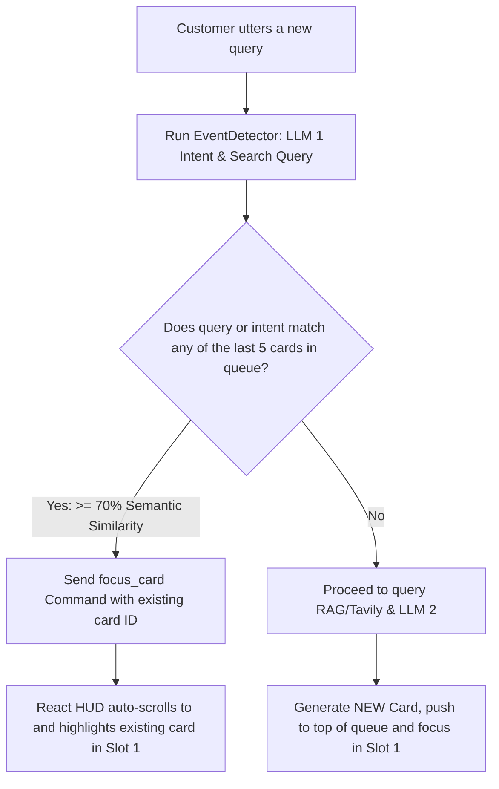

# Intelligent Focus & Bi-directional Scroll Alignment

This document proposes a dynamic HUD focusing architecture that replaces rigid card deletion gates with a scrollable card history deck, bullet-level check-offs, and bi-directional auto-focus alignment driven by both the Representative's speech and Customer interruptions.

---

## 1. Core Architectural Shifts

We are moving away from the "complete and discard cards" paradigm. Cues are persistent assets that the Rep might need to revisit, review, or finish out of order.

### A. Persistent Deck with Bullet-Level Check-offs
*   **No Card Deletion:** Cards are never removed from the `focusQueue` upon completion.
*   **Bullet Ticking:** Each card renders its list of cues (bullet points). When the Rep speaks a phrase matching a bullet cue, that specific bullet point transitions to a green, checked-off state. The parent card remains in the list.

### B. Bi-Directional Auto-Focus (Rep Speech Mode)
*   At any moment, **exactly one card** is focused in Slot 1 (`card-current` - top, glowing, 100% opacity) and **one card** is focused in Slot 2 (`card-previous` - bottom, 40% opacity, scaled down).
*   **Speech-Triggered Scroll Swap:** If the Rep speaks a cue belonging to the card currently sitting in Slot 2 (Previous Card), the HUD detects the match and instantly **swaps their slots** in the viewport. Slot 2 transitions to Slot 1, and Slot 1 moves to Slot 2, aligning the visual focus with the Rep's conversation track.

### C. Smart Deduplication & Scroll-Back (Customer Objections Mode)
When the customer asks a new question, before running RAG or querying LLM 2 to generate a new card, we check if a previous card already answers the query:



---

## 2. Technical Implementation Specifications

### A. Card Data Schema
Each card in `focusQueue` will store its classification context and target bullet embeddings:
```json
{
  "id": "card_id_123",
  "category": "FEES",
  "directionText": "Pitch pricing and EMI options",
  "searchQuery": "Newton School course fees financing",
  "bullets": [
    { "text": "Check scholarship eligibility", "phrase": "NSDC Interview test scholarship brings fees down", "completed": false },
    { "text": "Mention EMI starting at 6500", "phrase": "EMI options starting at 6500 a month", "completed": false }
  ]
}
```

### B. STT Proxy: Intercepting Repeated Objections (server.js)
We intercept duplicate queries *before* invoking the RAG & LLM 2 pipeline:
1.  When `detectResult` returns intents from LLM 1:
    *   Iterate through the last 5 cards in the active session's queue.
    *   Compare the new `searchQuery` (or customer utterance) against each card's `searchQuery` or target phrases using a fast semantic similarity check (or checking if the classified category matches an existing card's category).
2.  If similarity is **$> 0.70$**:
    *   **Bypass AI Generation:** Stop the pipeline. Do not query RAG or LLM 2.
    *   **Focus Command:** Send a WebSocket command:
        ```json
        { "type": "focus_card", "data": { "cardId": "card_id_123" } }
        ```

### C. React HUD: Visual Slot Transitions & Focus (App.jsx & App.css)
*   **HUD List State:** The UI renders the entire list of cards in `focusQueue`, but dynamically assigns classes based on a `focusedCardId` state:
    *   `card.id === focusedCardId` $\to$ `.card-current` (Slot 1, active focus).
    *   `card.id === previousCardId` $\to$ `.card-previous` (Slot 2, secondary focus).
    *   Other cards $\to$ `.card-docked` (rendered as collapsed title tabs or scrolled off-screen).
*   **Auto-Scroll Trigger:** When a `focus_card` WebSocket packet arrives, set `focusedCardId` to the target ID. The React app triggers `scrollIntoView({ behavior: 'smooth' })` to scroll the target card into the center Slot 1 slot, while CSS transitions handle the smooth scale, blur, and opacity changes.
*   **Bullet check-off loop:** The browser client continuously runs semantic checks on what the Rep says against all bullets in *both* Slot 1 and Slot 2 cards. If matched, mark that bullet as completed.
