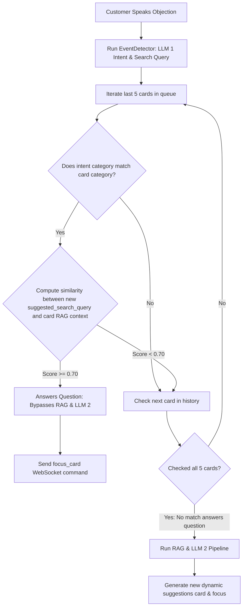

# Intelligent Focus & Bi-directional Scroll Alignment

This document specifies the technical design for a scroll-focused sales HUD. It implements bullet-level check-offs, speech-driven chronological focus navigation, semantic deduplication check-offs, and manual scroll overrides.

---

## 1. HUD Visual Focus (No Ordering Swapping)

To maintain a logical timeline, the chronological order of cards in `focusQueue` is **never modified or swapped**.

### A. Focused Slot Mapping
*   The React app maintains an active index `focusedIndex` (defaults to the last card).
*   The card at `focusQueue[focusedIndex]` receives the active class `.card-current` (glowing/highlighted border, 100% opacity).
*   The card at `focusQueue[focusedIndex - 1]` (if it exists) receives the class `.card-previous` (standard border, 100% opacity, no scale down, no blur).
*   All other cards are rendered normally in the scrollable timeline feed.

### B. Rep-Driven Scroll-Focus
*   The browser client continuously embeds the Rep's spoken sentences.
*   If the Rep speaks a cue belonging to *any* card in the history (whether in Slot 2 or further up the timeline), we simply update `focusedIndex` to that card's index.
*   The HUD smoothly scrolls to center the newly focused card in the Slot 1 position. The cards remain in their original chronological order.

---

## 2. "Answers the Question" Semantic Verification

When a customer utters a new query, the pipeline must verify if an existing card in the history already answers the query before deciding to scroll back or generate a new card.

### A. Execution Sequence (stt-proxy/server.js)

### B. Matching Mechanism Details
1.  **Intents & Query Extraction:** LLM 1 outputs the intent category (e.g. `DEGREE`) and a pronoun-resolved `suggested_search_query` (e.g. `"Newton School UGC recognition"` instead of *"is it approved?"*).
2.  **Category Filter:** We filter the last 5 cards in the history for matching categories.
3.  **Semantic Similarity Threshold:**
    *   We compute the cosine similarity between the new `suggested_search_query` and the RAG facts/instructions stored inside the candidate card.
    *   *Case A (Matches & Answers):*
        *   New Query: `"Newton School UGC recognition"`
        *   Existing Card Text: `"Our CS & AI degree is fully UGC-recognized through Rishihood University..."`
        *   Similarity Score: `0.85` ($\ge 0.70$).
        *   **Action:** Card answers the question. Trigger `focus_card` to scroll back.
    *   *Case B (Matches but does NOT Answer):*
        *   New Query: `"Rishihood University campus hostel infrastructure"`
        *   Existing Card Text: `"Our CS & AI degree is fully UGC-recognized through Rishihood University..."` (contains no hostel data).
        *   Similarity Score: `0.45` ($< 0.70$).
        *   **Action:** Card does not answer this question. Fall through to query RAG/Tavily and generate a **new card**.

---

## 3. Manual Scroll Overpower (Representative Override)

To prevent automatic scrolling from fighting the user during a call, the Representative's manual scroll actions will temporarily suspend all automated view adjustments.

### A. Scroll Interceptors
In the React suggestion container, we listen for:
*   `onWheel` (mouse scroll wheel)
*   `onTouchStart` / `onTouchMove` (mobile swipe)
*   `onScroll` (dragging the scrollbar)
*   `onKeyDown` (ArrowUp, ArrowDown, PageUp, PageDown)

### B. Manual Lock State
*   Upon detecting any of these manual inputs, set `isManualScrollMode = true`.
*   A floating indicator appears: **"Auto-Scroll Paused (Click to Resume)"**.
*   While `isManualScrollMode === true`:
    *   New cards are still appended, and spoken cues are still checked off, but **no scroll adjustments** are performed. The viewport remains locked.
*   **Resuming Auto-Scroll:**
    *   The lock is cleared, resetting `isManualScrollMode = false` and scrolling back to center the active card, when:
        1.  The Rep clicks the **Resume** button.
        2.  Or a new card is generated and flashes in.
        3.  Or the interface detects $8$ seconds of scroll inactivity.
