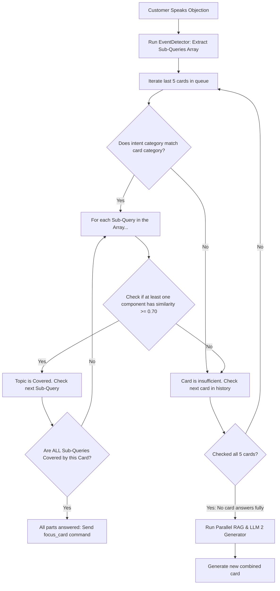

# Intelligent Focus & Bi-directional Scroll Alignment

This document specifies the technical design for a scroll-focused sales HUD. It implements bullet-level check-offs, speech-driven chronological focus navigation, semantic deduplication, compound query splitting, and manual scroll overrides.

---

## 1. HUD Visual Focus (No Ordering Swapping)

To maintain a logical timeline, the chronological order of cards in `focusQueue` is **never modified or swapped**.

### A. Focused Slot Mapping
*   The React app maintains an active index `focusedIndex` (defaults to the last card).
*   The card at `focusQueue[focusedIndex]` receives the active class `.card-current` (glowing/highlighted border, 100% opacity).
*   The card at `focusQueue[focusedIndex - 1]` (if it exists) receives the class `.card-previous` (standard border, 100% opacity, no scale down, no blur).
*   All other cards are rendered normally in the scrollable timeline feed.

### B. Rep-Driven Scroll-Focus
*   The browser client continuously embeds the Rep's spoken sentences.
*   If the Rep speaks a cue belonging to *any* card in the history, we simply update `focusedIndex` to that card's index.
*   The HUD smoothly scrolls to center the newly focused card. The cards remain in their original chronological order.

---

## 2. Query Decomposition & "Answers the Question" Verification

To handle compound objections and prevent visual card duplication, the pipeline decomposes incoming customer queries and verifies if the combination of bullets on an existing card already answers the query.

### A. Parallel Query Splitting Pipeline
When the customer raises an objection, LLM 1 (Groq Classifier) processes the utterance:
1.  **Intent Classification:** LLM 1 detects all active category codes (e.g. `[FEES, PLACEMENT]`).
2.  **Query Decomposition:** Instead of a single averaged query, LLM 1 outputs an array of distinct, pronoun-resolved sub-topic search queries (e.g. `["Newton School fees cost", "Newton School placement statistics"]`).
3.  **Parallel RAG Search:** The proxy server takes this array and runs concurrent vector lookups (using `Promise.all` in Node.js) to fetch precise, non-diluted facts for each query.
4.  **LLM Ingestion:** The proxy server injects all split-retrieved local RAG facts and Tavily web snippets into LLM 2's prompt context. LLM 2 naturally compiles the facts into suggestions without any changes to its output format rules.

### B. Combinatorial Bullet Coverage Verification
Before proceeding to generate a new card, the proxy server scans the last 5 cards in the history to check if their existing bullet points already answer the decomposed queries.

### C. Matching Mechanism Examples

#### Case A: Combinatorial Match (Card answers all parts of a compound question)
*   **Customer Objection:** *"Is Newton School UGC recognized, and when do batches start?"*
*   **Sub-Queries Array:** `["Newton School UGC recognition", "Newton School batch startup timeline"]`
*   **Existing Card Bullets:**
    *   *Bullet 1:* *"CS & AI degree is fully UGC-recognized through Rishihood..."*
    *   *Bullet 2:* *"New batch class starts in January..."*
*   **Verification:**
    *   *Sub-Query 1 ("UGC recognition")* matches *Bullet 1* with similarity `0.85` ($\ge 0.70$) $\to$ **Covered!**
    *   *Sub-Query 2 ("batch startup")* matches *Bullet 2* with similarity `0.88` ($\ge 0.70$) $\to$ **Covered!**
    *   *Result:* All sub-queries are covered. **Action:** Scroll back to existing card.

#### Case B: Partial Match (Card does NOT answer all parts)
*   **Customer Objection:** *"Is Newton School UGC recognized, and does the campus have a swimming pool?"*
*   **Sub-Queries Array:** `["Newton School UGC recognition", "Rishihood campus swimming pool"]`
*   **Existing Card Bullets:** Same as Case A.
*   **Verification:**
    *   *Sub-Query 1 ("UGC recognition")* matches *Bullet 1* with similarity `0.85` ($\ge 0.70$) $\to$ **Covered!**
    *   *Sub-Query 2 ("swimming pool")* matches *Bullet 1* (`0.12` sim) and *Bullet 2* (`0.08` sim) $\to$ **Uncovered!**
    *   *Result:* Query 2 is uncovered. **Action:** Fall through, execute RAG for swimming pool details, and generate a **new card**.

---

## 3. Manual Scroll Overpower (Representative Override)

To prevent automatic scrolling from fighting the user during a call, the Representative's manual scroll actions will temporarily suspend all automated view adjustments.

### A. Scroll Interceptors
In the React suggestion container, we listen for:
*   `onWheel` (mouse scroll wheel)
*   `onTouchStart` / `onTouchMove` (mobile swipe)
*   `onScroll` (dragging the scrollbar)
*   `onKeyDown` (ArrowUp, ArrowDown, PageUp, PageDown)

### B. Manual Lock State
*   Upon detecting any of these manual inputs, set `isManualScrollMode = true`.
*   A floating indicator appears: **"Auto-Scroll Paused (Click to Resume)"**.
*   While `isManualScrollMode === true`:
    *   New cards are still appended, and spoken cues are still checked off, but **no scroll adjustments** are performed. The viewport remains locked.
*   **Resuming Auto-Scroll:**
    *   The lock is cleared, resetting `isManualScrollMode = false` and scrolling back to center the active card, when:
        1.  The Rep clicks the **Resume** button.
        2.  Or a new card is generated and flashes in.
        3.  Or the interface detects $8$ seconds of scroll inactivity.
