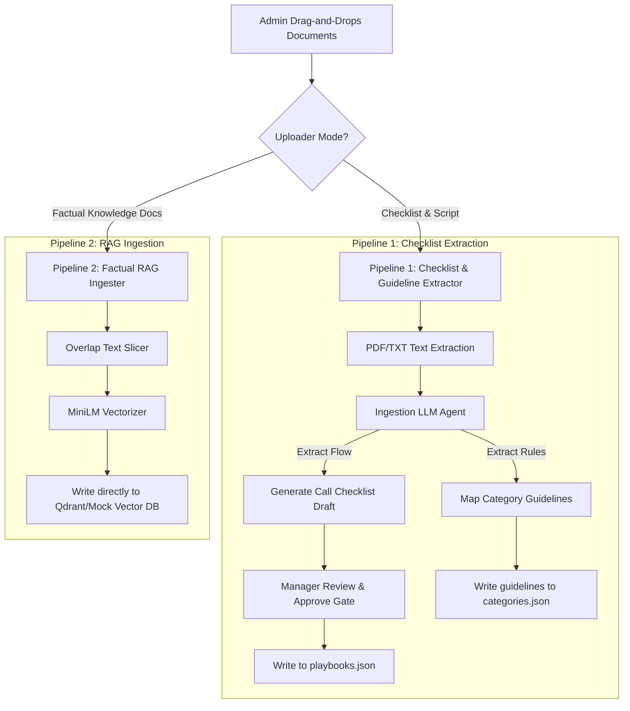

# Playbook & RAG Ingestion Pipeline Architecture

This document specifies the technical design for a future administrative ingestion system. The system divides playbook uploads into a **Checklist/Guideline Extractor** (Pipeline 1) and a **Factual RAG Ingester** (Pipeline 2).

---

## Architecture Overview

Admin managers require a simple, drag-and-drop system to upload playbooks. The system splits ingestion into two distinct lanes:



---

## 1. Pipeline 1: Checklist & Guideline Extractor

### A. Automatic Ingestion & Decomposition
When an administrative manager uploads a core sales training manual or script (e.g. `Sales Training (1).txt`):
1.  **File Parsing:** Extractor pulls plain text from PDF, DOCX, or TXT.
2.  **Decomposition Agent:** A large-context LLM (e.g. Gemini 1.5 Pro) reads the text alongside our existing categories schema (`categories.json`) and outputs a structured JSON payload:
    *   `checklist_steps`: A sequential list containing a title, description, and key phrase triggers (e.g., *"Probing Education Background"*).
    *   `category_guidelines`: Playbook-specific guidelines mapped directly to category keys (e.g., mapping Simplilearn comparisons to `COMPETITOR`).
    *   `new_categories`: Suggested categories discovered in the playbook that are missing from our system.

### B. The Manager Approval Gate (UI Checklist Editor)
Rather than writing directly to system config files:
1.  The UI renders the parsed checklist in an interactive **Checklist Editor** interface.
2.  The manager reviews the steps, edits titles, shifts sequence, adds/removes items, and approves guidelines mapping.
3.  Upon approval, the system commits the updates:
    *   Checklist steps are added to the playbook entry in `playbooks.json`.
    *   Guidelines are written to `categories.json` and `keyword_bypasses.json`.

### C. Browser-to-Server Call Progress Alignment
To ensure LLM 2 understands the current checklist stage without bloating prompts with the full checklist text:
1.  The browser's local MiniLM model tracks the Sales Rep's transcript. When a stage-trigger matches, it ticks off the step in the progress bar.
2.  When sending utterances over the WebSocket, the client app appends the active checklist step name:
    ```json
    { "type": "speech_frame", "text": "...", "activeChecklistStep": "Probing: Education Qualification" }
    ```
3.  The STT Proxy server injects this metadata as a single line at the top of the LLM 2 user prompt:
    `[CURRENT CALL STAGE]: Step 4 of 20 - Probing: Education Qualification`
    This aligns the suggestion model with the conversational stage at a cost of near-zero tokens.

---

## 2. Pipeline 2: Factual RAG Ingester

For uploading raw company fact sheets, security compliance guides, pricing matrices, or product spec sheets:
1.  **Direct Ingestion:** The document is uploaded directly to the RAG processing pipeline.
2.  **Text Slicing:** A document splitter cuts the text into semantic, overlapping chunks (e.g., 500-character chunks with a 100-character overlap) to preserve local context.
3.  **Vector Embedding:** Chunks are vectorized using the RAG model (e.g., `all-MiniLM-L6-v2`).
4.  **Vector Store Commit:** Embeddings are written directly into the Vector Database (Qdrant) under the corresponding `playbook` collection partition. No guidelines or checklists are modified.

---

## 3. Implementation Phasing Strategy

*   **Phase 1 (Current):** Finish UI tasks (Topic-Tagged Badges, Option B whole-card check-off cascades).
*   **Phase 2 (Next):** Implement the Call Progress Checklist HUD component and seed current playbook objections into config guidelines.
*   **Phase 3 (Future):** Build Pipelines 1 and 2 with administrative uploader UI controls.
